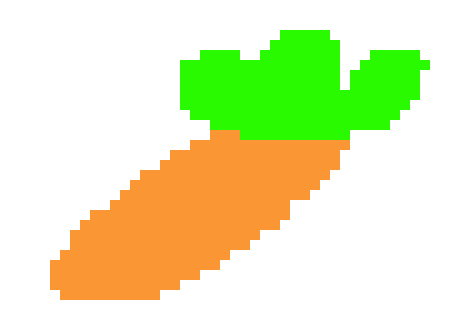

# Welcome to the Children's Health Game Official Website

#### *Created by Michael Graves and Ryan Gaulding using Godot.*

Why We Created This Game

We created this game to provide an avenue for healthcare professionals to more easily and reliable spread important messages to the youths. 

The old way of handing out sheets of paper and having them read is no more, with this solution children can do what they do best, play video games, while at the same time getting important health facts to improve their lives.

This game focuses on childhood obesity, and tries to show the negative affects of fastfood as well as the benefits of healthy foods such as fruits and vegtables.

hello
### How To Play

The basics of the game is very similiar to that of a [brick breaker](https://en.wikipedia.org/wiki/Brick_Breaker), but with a twist. 

### Contact/Credit

This was created by Michael Graves and Ryan Gaulding during **HackDFW 2021.**
You can find Michael's github [here](https://github.com/nsx00/ChildrensHealthGame) and you can find Ryan's github [here](https://github.com/BigDaddyBlue42) to see other projects we have worked on.
